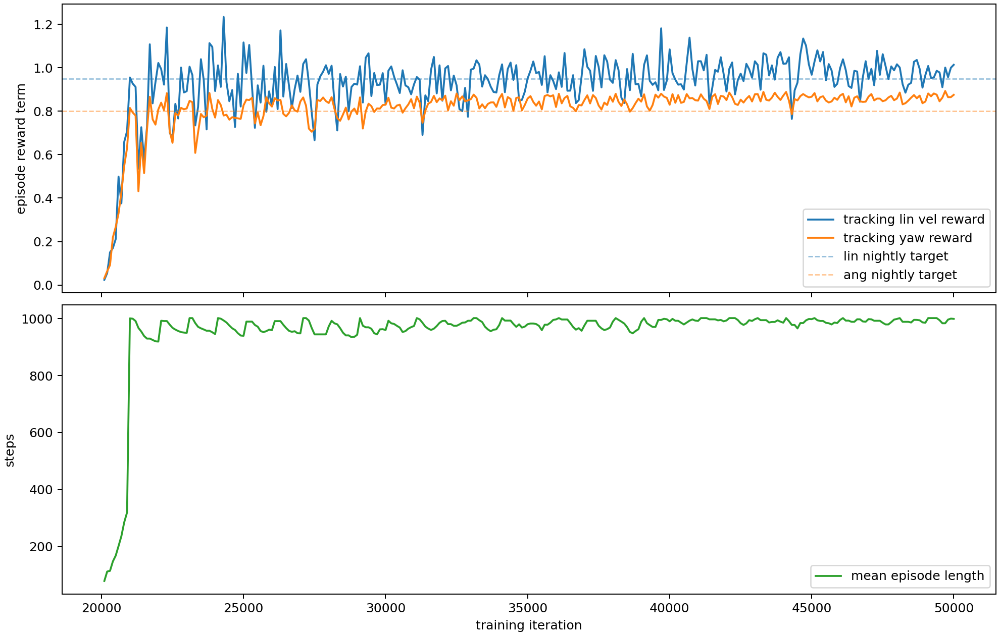
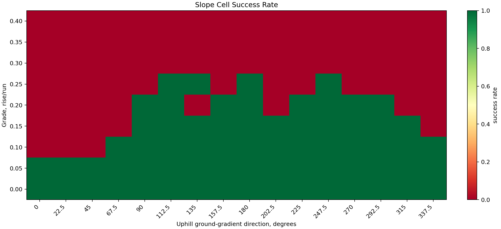
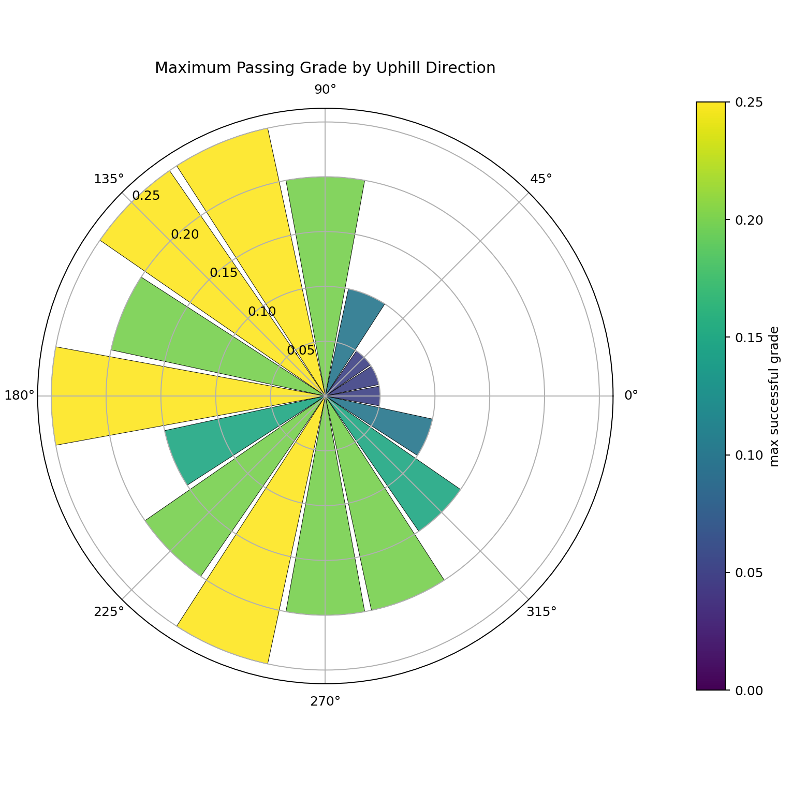
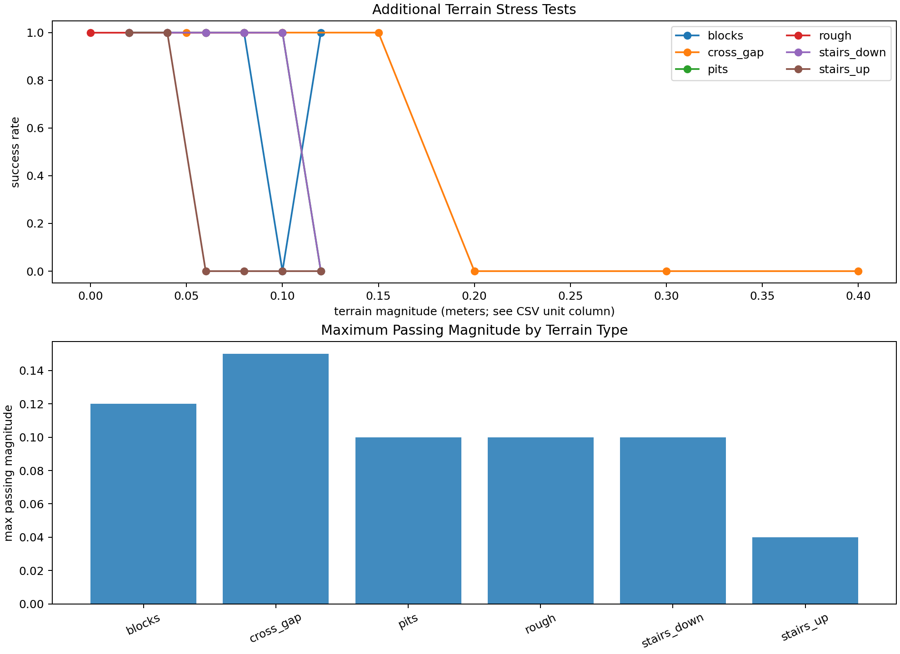

# Holosoma G1 FastSAC Slope Robustness

Model: `/home/smp/projects/holosoma/logs/hv-g1-manager/20260508_090804-rtx3080_1024bs2048_isaacgym_fastsac_defaultmix_resume20k_to_50000-locomotion/model_0050000.onnx`

Overall trial success rate: `0.472`

Training used IsaacGym on default mixed terrain with RTX-3080-safe parameters:
`num_envs=1024`, `batch_size=2048`, `compile=False`.

The final evaluated checkpoint is the completed 50k ONNX export.

Latest parsed training metrics: iteration `50000.0000`,
linear tracking `1.0139`, angular tracking `0.8756`.

IsaacGym was stable under WSL2 with `/usr/lib/wsl/lib` in `LD_LIBRARY_PATH`.
MJWarp was not used for the final policy because it failed earlier on default mixed terrain.

## Direction Thresholds

| Uphill direction deg | Max passing grade | Slope angle deg |
|---:|---:|---:|
| 0.0 | 0.05 | 2.9 |
| 22.5 | 0.05 | 2.9 |
| 45.0 | 0.05 | 2.9 |
| 67.5 | 0.10 | 5.7 |
| 90.0 | 0.20 | 11.3 |
| 112.5 | 0.25 | 14.0 |
| 135.0 | 0.25 | 14.0 |
| 157.5 | 0.20 | 11.3 |
| 180.0 | 0.25 | 14.0 |
| 202.5 | 0.15 | 8.5 |
| 225.0 | 0.20 | 11.3 |
| 247.5 | 0.25 | 14.0 |
| 270.0 | 0.20 | 11.3 |
| 292.5 | 0.20 | 11.3 |
| 315.0 | 0.15 | 8.5 |
| 337.5 | 0.10 | 5.7 |

## Additional Terrain Stress Tests

Overall terrain-stress trial success rate: `0.722`.

| Terrain type | Max passing magnitude | Unit | Passing cells | Tested cells |
|---|---:|---|---:|---:|
| blocks | 0.120 | m_height | 5 | 6 |
| cross_gap | 0.150 | m_width | 3 | 6 |
| pits | 0.100 | m_depth | 5 | 6 |
| rough | 0.100 | m_amp | 6 | 6 |
| stairs_down | 0.100 | m_step | 5 | 6 |
| stairs_up | 0.040 | m_step | 2 | 6 |

